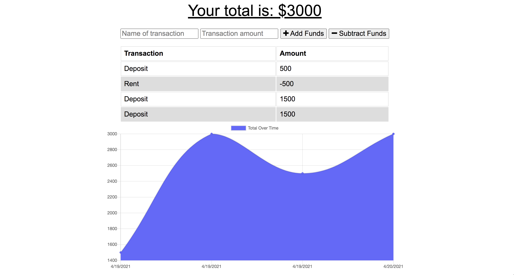
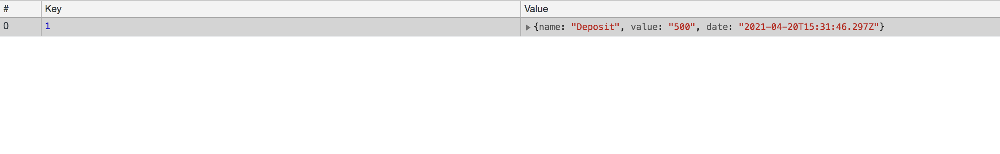

# BudgetTracker

This is a simple budget tracker that stores transactions in a MongoDB database (using Atlas Cloud DB). 



The static files are cached using a service worker so if the app is offline it will still be accessible, storing offline transactions in the IndexedDB then sending them to the main database once back online.



## User Story

```
AS AN avid traveller
I WANT to be able to track my withdrawals and deposits with or without a data/internet connection
SO THAT my account balance is accurate when I am traveling
```

## Deployment

The app is deployed at <a href="https://obscure-ravine-45710.herokuapp.com/">https://obscure-ravine-45710.herokuapp.com</a>.

